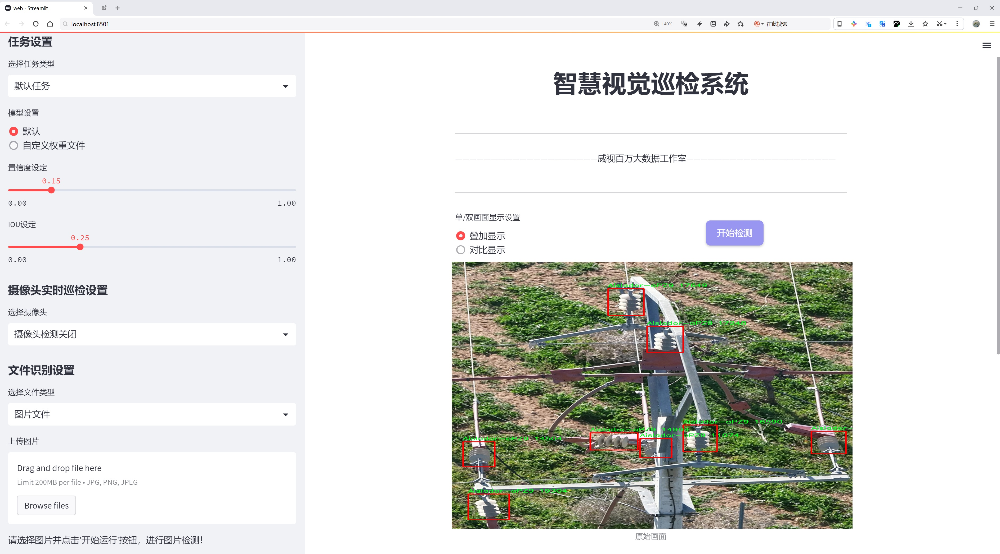
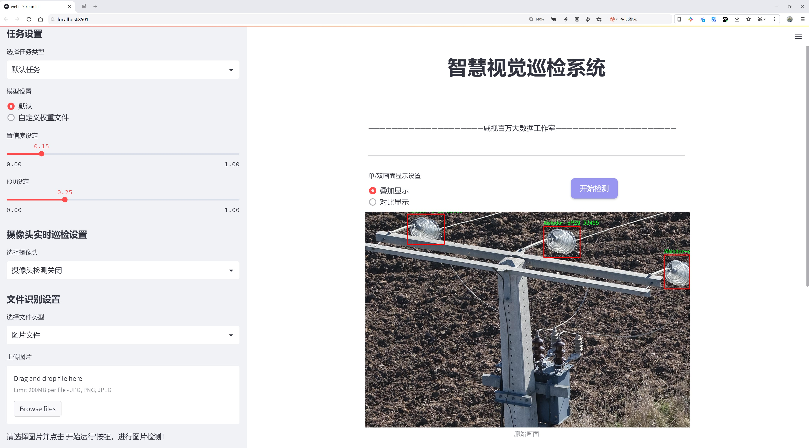
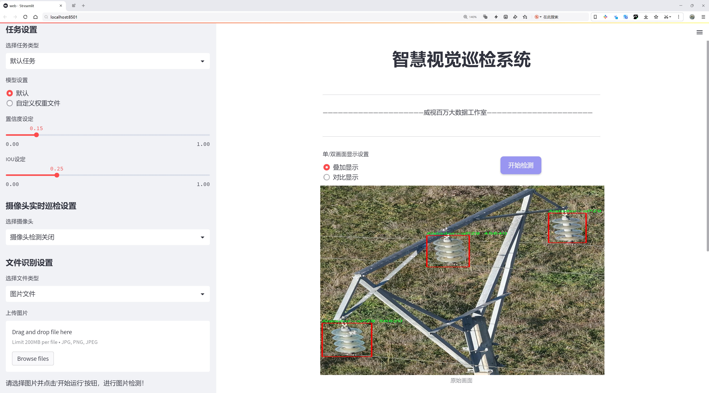
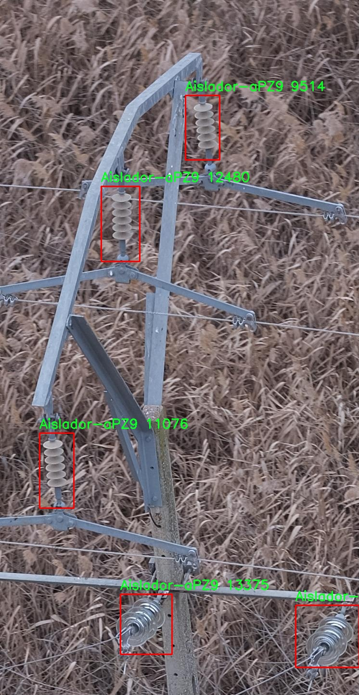
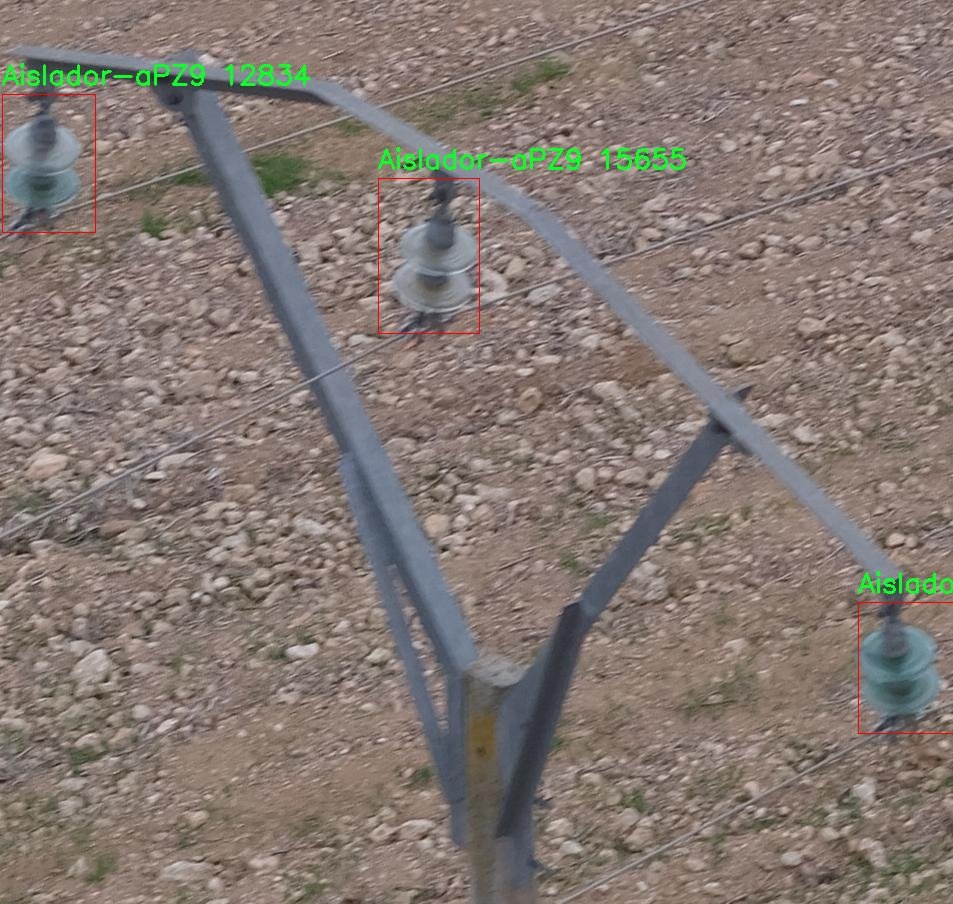
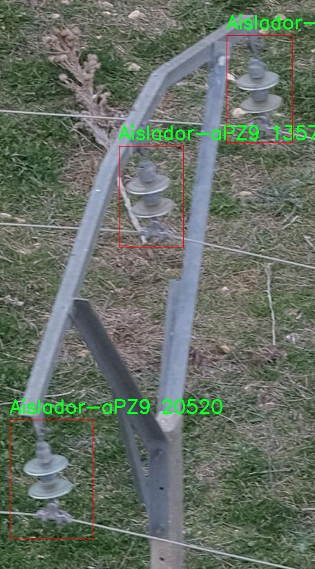
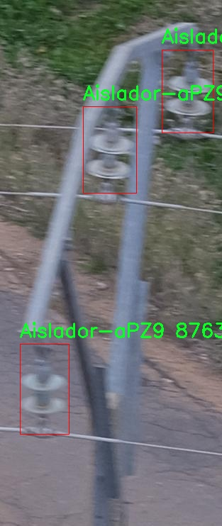
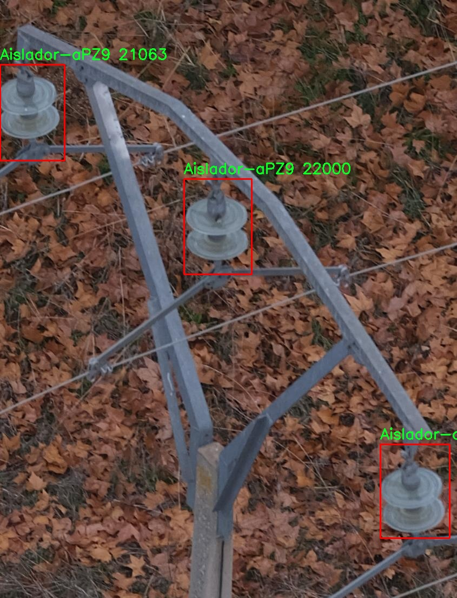

# 绝缘子检测检测系统源码分享
 # [一条龙教学YOLOV8标注好的数据集一键训练_70+全套改进创新点发刊_Web前端展示]

### 1.研究背景与意义

项目参考[AAAI Association for the Advancement of Artificial Intelligence](https://gitee.com/qunshansj/projects)

项目来源[AACV Association for the Advancement of Computer Vision](https://gitee.com/qunmasj/projects)

研究背景与意义

随着电力系统的不断发展，绝缘子作为电力设备中不可或缺的组成部分，其安全性和可靠性直接关系到电力系统的稳定运行。绝缘子的主要功能是防止电流泄漏，确保电力传输的安全。然而，绝缘子在长期的使用过程中，受到环境因素、机械应力和电气应力的影响，可能会出现老化、破损等问题，从而导致电力设备的故障。因此，及时、准确地检测绝缘子的状态，对于保障电力系统的安全运行具有重要意义。

近年来，计算机视觉技术的迅猛发展为绝缘子检测提供了新的解决方案。尤其是基于深度学习的目标检测算法，如YOLO（You Only Look Once）系列，因其高效的实时检测能力和良好的检测精度，逐渐成为电力设备检测领域的研究热点。YOLOv8作为该系列的最新版本，具备了更强的特征提取能力和更快的推理速度，能够在复杂的环境中实现对绝缘子的高效检测。然而，现有的YOLOv8模型在特定应用场景下，尤其是针对绝缘子这种特定目标的检测，仍然存在一定的局限性。

本研究旨在基于改进的YOLOv8模型，构建一个高效的绝缘子检测系统。为此，我们使用了名为“Aisladores 3”的数据集，该数据集包含3046张绝缘子图像，涵盖了绝缘子类别“aPZ9”。通过对该数据集的深入分析，我们将探索如何优化YOLOv8模型的结构和参数设置，以提高其在绝缘子检测任务中的表现。具体而言，我们将重点关注数据增强、模型剪枝和迁移学习等技术，以增强模型的泛化能力和鲁棒性，从而提高绝缘子检测的准确性和效率。

本研究的意义不仅在于提升绝缘子检测的技术水平，更在于为电力行业提供一种新的检测手段，降低人工巡检的成本和风险。通过实现自动化的绝缘子检测系统，能够大幅提高检测效率，减少人为因素导致的误判和漏判，进而保障电力系统的安全运行。此外，该系统的成功应用还将为其他电力设备的检测提供借鉴，推动智能电网和智能巡检技术的发展。

综上所述，基于改进YOLOv8的绝缘子检测系统的研究，不仅具有重要的理论价值，还有着广泛的实际应用前景。通过本研究，我们期望能够为电力行业的智能化转型贡献一份力量，推动电力设备的智能检测技术向更高水平发展。

### 2.图片演示







##### 注意：由于此博客编辑较早，上面“2.图片演示”和“3.视频演示”展示的系统图片或者视频可能为老版本，新版本在老版本的基础上升级如下：（实际效果以升级的新版本为准）

  （1）适配了YOLOV8的“目标检测”模型和“实例分割”模型，通过加载相应的权重（.pt）文件即可自适应加载模型。

  （2）支持“图片识别”、“视频识别”、“摄像头实时识别”三种识别模式。

  （3）支持“图片识别”、“视频识别”、“摄像头实时识别”三种识别结果保存导出，解决手动导出（容易卡顿出现爆内存）存在的问题，识别完自动保存结果并导出到tempDir中。

  （4）支持Web前端系统中的标题、背景图等自定义修改，后面提供修改教程。

  另外本项目提供训练的数据集和训练教程,暂不提供权重文件（best.pt）,需要您按照教程进行训练后实现图片演示和Web前端界面演示的效果。

### 3.视频演示

[3.1 视频演示](https://www.bilibili.com/video/BV1vT4aekEyy/)

### 4.数据集信息展示

##### 4.1 本项目数据集详细数据（类别数＆类别名）

nc: 1
names: ['Aislador-aPZ9']


##### 4.2 本项目数据集信息介绍

数据集信息展示

在本研究中，我们使用了名为“Aisladores 3”的数据集，以支持对改进YOLOv8的绝缘子检测系统的训练与评估。该数据集专注于电力行业中重要的绝缘子组件，尤其是“Aislador-aPZ9”这一特定类别。数据集的设计旨在提供丰富的图像样本，以便于模型在实际应用中能够有效识别和分类该类型的绝缘子。

“Aisladores 3”数据集的类别数量为1，具体类别为“Aislador-aPZ9”。这一类别的选择反映了电力设备维护和监测中的实际需求，尤其是在高压电力线路的运行和维护过程中，绝缘子的状态直接关系到电力系统的安全与稳定。通过对这一特定类别的深入研究，我们能够训练出更为精准的检测模型，以识别绝缘子在不同环境和光照条件下的表现。

数据集的构建过程涉及多种拍摄条件和角度，以确保模型能够在多样化的场景中进行有效的学习。样本图像包括绝缘子在不同背景下的表现，涵盖了多种自然和人工环境。这样的多样性不仅增强了模型的泛化能力，也为后续的实际应用提供了坚实的基础。此外，数据集中还包含了绝缘子在不同状态下的图像，如新旧程度、清洁度以及在各种气候条件下的表现。这些因素都是影响绝缘子性能的重要变量，因此在数据集中进行全面的覆盖是至关重要的。

为了确保数据集的质量，所有图像均经过严格的筛选和标注，确保每一张图像都能够准确反映出“Aislador-aPZ9”的特征。标注过程中，采用了高精度的图像标注工具，确保绝缘子的边界框准确无误。这一过程不仅提高了数据集的可靠性，也为后续的模型训练提供了高质量的输入数据。

在训练过程中，我们将利用“Aisladores 3”数据集对YOLOv8模型进行调优，以提高其在绝缘子检测任务中的准确性和效率。通过对模型进行反复训练和验证，我们期望能够实现更高的检测精度和更快的推理速度，使得该检测系统能够在实际应用中实时监测绝缘子的状态，及时发现潜在的故障隐患。

综上所述，“Aisladores 3”数据集不仅为本研究提供了必要的基础数据，也为后续的模型训练和评估奠定了坚实的基础。通过对这一数据集的深入分析和应用，我们希望能够推动绝缘子检测技术的发展，提高电力系统的安全性和可靠性，为电力行业的智能化管理贡献力量。











### 5.全套项目环境部署视频教程（零基础手把手教学）

[5.1 环境部署教程链接（零基础手把手教学）](https://www.ixigua.com/7404473917358506534?logTag=c807d0cbc21c0ef59de5)


[5.2 安装Python虚拟环境创建和依赖库安装视频教程链接（零基础手把手教学）](https://www.ixigua.com/7404474678003106304?logTag=1f1041108cd1f708b01a)

### 6.手把手YOLOV8训练视频教程（零基础小白有手就能学会）

[6.1 手把手YOLOV8训练视频教程（零基础小白有手就能学会）](https://www.ixigua.com/7404477157818401292?logTag=d31a2dfd1983c9668658)

### 7.70+种全套YOLOV8创新点代码加载调参视频教程（一键加载写好的改进模型的配置文件）

[7.1 70+种全套YOLOV8创新点代码加载调参视频教程（一键加载写好的改进模型的配置文件）](https://www.ixigua.com/7404478314661806627?logTag=29066f8288e3f4eea3a4)

### 8.70+种全套YOLOV8创新点原理讲解（非科班也可以轻松写刊发刊，V10版本正在科研待更新）

由于篇幅限制，每个创新点的具体原理讲解就不一一展开，具体见下列网址中的创新点对应子项目的技术原理博客网址【Blog】：


[8.1 70+种全套YOLOV8创新点原理讲解链接](https://gitee.com/qunmasj/good)

### 9.系统功能展示（检测对象为举例，实际内容以本项目数据集为准）

图9.1.系统支持检测结果表格显示

  图9.2.系统支持置信度和IOU阈值手动调节

  图9.3.系统支持自定义加载权重文件best.pt(需要你通过步骤5中训练获得)

  图9.4.系统支持摄像头实时识别

  图9.5.系统支持图片识别

  图9.6.系统支持视频识别

  图9.7.系统支持识别结果文件自动保存

  图9.8.系统支持Excel导出检测结果数据


### 10.原始YOLOV8算法原理

原始YOLOv8算法原理

YOLOv8算法是目标检测领域的一项重要进展，代表了YOLO系列算法的最新成果。该算法在YOLOv5和YOLOv7的基础上进行了多项创新和优化，旨在提高目标检测的精度和速度。YOLOv8的设计理念强调高效性和准确性，尤其在处理复杂场景和小目标时表现出色。

首先，YOLOv8在骨干网络的设计上延续了跨级结构（Cross Stage Partial, CSP）的思想，但对YOLOv5中的C3模块进行了优化，替换为更轻量的C2f模块。这一变化不仅减少了计算复杂度，还保持了检测精度。C2f模块的设计灵感来源于YOLOv7的ELAN结构，通过引入多个分支和短路连接，增强了特征的重用性和梯度流动性。这种设计使得网络在深层模型中能够有效缓解梯度消失和梯度爆炸的问题，从而提高了模型的收敛速度和效果。

在特征提取方面，YOLOv8依然采用了特征金字塔网络（FPN）和空间金字塔池化（SPPF）模块，以充分利用不同尺度的特征信息。与YOLOv5相比，YOLOv8在上采样阶段删除了卷积结构，简化了网络架构，进一步提高了计算效率。同时，YOLOv8采用了PAN-FPN结构，这种结构通过自下而上的特征融合方式，能够更好地整合浅层特征和高层特征，确保网络在多尺度目标检测中的表现更加出色。

YOLOv8在损失函数的设计上也进行了创新，采用了变焦损失（VFLLoss）来计算分类损失，同时结合数据平均保真度损失（DFLLoss）和完美交并比损失（CIoULoss）来计算边界框损失。这种新的损失策略使得YOLOv8在训练过程中能够更准确地评估目标的分类和定位，从而提升了整体检测性能。此外，YOLOv8摒弃了传统的Anchor-Base方法，转而采用Anchor-Free的思想，这一转变使得模型在处理不同尺寸和形状的目标时更加灵活。

在样本匹配策略上，YOLOv8采用了Task-Aligned的Assigner匹配方式，取代了以往的静态匹配。这一策略使得模型能够更有效地匹配目标和预测框，提升了检测的准确性和鲁棒性。通过结合新的样本匹配方式，YOLOv8能够在高效率的基础上实现更为精准的目标检测。

YOLOv8的输入层、主干网络、特征融合层和解耦头的设计构成了其完整的网络架构。输入层负责将图像数据转换为统一的输入格式，主干网络则通过一系列卷积和归一化操作提取图像特征。特征融合层利用PAN-FPN结构将不同层次的特征进行深度融合，确保网络能够同时捕捉到细节信息和语义信息。解耦头部分则负责将融合后的特征图转换为最终的检测结果，输出目标的类别和边界框信息。

在具体实现中，YOLOv8采用了多种数据增强技术，如马赛克增强、混合增强、空间扰动和颜色扰动等，以提高模型的泛化能力。这些增强手段能够有效增加训练样本的多样性，使得模型在面对不同场景和条件时表现更加稳健。

综上所述，YOLOv8算法通过对网络结构的优化、损失函数的创新以及样本匹配策略的改进，成功地提升了目标检测的性能。其轻量化的设计和高效的特征提取能力，使得YOLOv8在实时目标检测任务中展现出卓越的表现。随着YOLOv8的推出，目标检测技术在精度和速度上都取得了显著的进步，为智能监控、自动驾驶、人脸识别等应用场景提供了强有力的支持。未来，YOLOv8的进一步改进和应用将为目标检测领域带来更多的可能性和挑战。


### 11.项目核心源码讲解（再也不用担心看不懂代码逻辑）

#### 11.1 code\ultralytics\models\yolo\classify\train.py

以下是经过精简和注释的核心代码部分，主要保留了分类训练器的基本功能和流程：

```python
# 导入必要的库
import torch
from ultralytics.data import ClassificationDataset, build_dataloader
from ultralytics.engine.trainer import BaseTrainer
from ultralytics.models import yolo
from ultralytics.nn.tasks import ClassificationModel
from ultralytics.utils import DEFAULT_CFG, LOGGER, RANK, colorstr

class ClassificationTrainer(BaseTrainer):
    """
    扩展自 BaseTrainer 类，用于基于分类模型的训练。
    """

    def __init__(self, cfg=DEFAULT_CFG, overrides=None, _callbacks=None):
        """初始化 ClassificationTrainer 对象，支持配置覆盖和回调函数。"""
        if overrides is None:
            overrides = {}
        overrides["task"] = "classify"  # 设置任务类型为分类
        if overrides.get("imgsz") is None:
            overrides["imgsz"] = 224  # 默认图像大小
        super().__init__(cfg, overrides, _callbacks)

    def set_model_attributes(self):
        """从加载的数据集中设置 YOLO 模型的类名。"""
        self.model.names = self.data["names"]

    def get_model(self, cfg=None, weights=None, verbose=True):
        """返回配置好的 PyTorch 模型以进行 YOLO 训练。"""
        model = ClassificationModel(cfg, nc=self.data["nc"], verbose=verbose and RANK == -1)
        if weights:
            model.load(weights)  # 加载权重

        for m in model.modules():
            if not self.args.pretrained and hasattr(m, "reset_parameters"):
                m.reset_parameters()  # 重置参数
        for p in model.parameters():
            p.requires_grad = True  # 设置为可训练
        return model

    def build_dataset(self, img_path, mode="train"):
        """根据图像路径和模式（训练/测试等）创建 ClassificationDataset 实例。"""
        return ClassificationDataset(root=img_path, args=self.args, augment=mode == "train", prefix=mode)

    def get_dataloader(self, dataset_path, batch_size=16, rank=0, mode="train"):
        """返回带有图像预处理的 PyTorch DataLoader。"""
        dataset = self.build_dataset(dataset_path, mode)  # 构建数据集
        loader = build_dataloader(dataset, batch_size, self.args.workers, rank=rank)  # 构建数据加载器
        return loader

    def preprocess_batch(self, batch):
        """预处理一批图像和类标签。"""
        batch["img"] = batch["img"].to(self.device)  # 将图像移动到设备
        batch["cls"] = batch["cls"].to(self.device)  # 将类标签移动到设备
        return batch

    def get_validator(self):
        """返回 ClassificationValidator 实例以进行验证。"""
        self.loss_names = ["loss"]  # 定义损失名称
        return yolo.classify.ClassificationValidator(self.test_loader, self.save_dir, _callbacks=self.callbacks)

    def final_eval(self):
        """评估训练后的模型并保存验证结果。"""
        for f in self.last, self.best:
            if f.exists():
                if f is self.best:
                    LOGGER.info(f"\nValidating {f}...")
                    self.metrics = self.validator(model=f)  # 验证模型
        LOGGER.info(f"Results saved to {colorstr('bold', self.save_dir)}")  # 打印结果保存路径
```

### 代码说明：
1. **导入库**：导入了必要的 PyTorch 和 Ultralytics 相关模块。
2. **ClassificationTrainer 类**：继承自 `BaseTrainer`，用于分类任务的训练。
3. **初始化方法**：设置任务类型和默认图像大小。
4. **模型设置**：包括模型属性的设置、模型的获取和构建数据集的方法。
5. **数据加载**：构建数据加载器以处理训练和验证数据。
6. **预处理方法**：将图像和标签移动到计算设备上。
7. **验证方法**：提供模型验证的功能，并在训练结束后评估模型。

通过以上精简和注释，代码的核心功能和逻辑得以保留，同时增强了可读性。

这个文件是一个用于训练分类模型的Python脚本，属于Ultralytics YOLO项目的一部分。它定义了一个名为`ClassificationTrainer`的类，该类继承自`BaseTrainer`，用于处理图像分类任务。以下是对代码的逐行分析和说明。

首先，文件导入了一些必要的库和模块，包括PyTorch、Torchvision以及Ultralytics项目中的特定模块。这些模块提供了数据集处理、模型训练和图像处理等功能。

`ClassificationTrainer`类的构造函数`__init__`接受配置参数和覆盖参数，并初始化训练器。它设置了任务类型为“classify”，并确保图像大小默认为224。如果没有提供其他参数，使用默认配置。

`set_model_attributes`方法用于从加载的数据集中设置YOLO模型的类名。这是为了确保模型能够正确识别不同的类别。

`get_model`方法负责返回一个经过修改的PyTorch模型，以便进行YOLO训练。它会根据提供的配置和权重加载模型，并设置模型参数为可训练状态。

`setup_model`方法用于加载、创建或下载模型。如果模型已经是一个PyTorch模块，则不需要进行任何设置。如果模型是以`.pt`结尾的文件，它会尝试加载权重；如果是以`.yaml`结尾的配置文件，则调用`get_model`方法获取模型；如果是Torchvision中的模型，则直接加载。最后，它会调整模型的输出以适应分类任务。

`build_dataset`方法创建一个`ClassificationDataset`实例，接收图像路径和模式（如训练或测试）作为参数。

`get_dataloader`方法返回一个PyTorch的DataLoader，用于图像的预处理和加载。它会在分布式训练时确保数据集只初始化一次，并附加推理转换。

`preprocess_batch`方法对一批图像和类进行预处理，将它们移动到指定的设备上（如GPU）。

`progress_string`方法返回一个格式化的字符串，显示训练进度，包括当前的Epoch、GPU内存使用情况和损失值等。

`get_validator`方法返回一个`ClassificationValidator`实例，用于验证模型的性能。它会设置损失名称以便于后续的记录和分析。

`label_loss_items`方法返回一个带有标签的损失字典，尽管对于分类任务并不需要，但在分割和检测任务中是必要的。

`plot_metrics`方法从CSV文件中绘制指标，保存结果图像。

`final_eval`方法用于评估训练后的模型并保存验证结果。它会检查最后的和最佳的模型文件，剥离优化器，并在验证模型时记录结果。

最后，`plot_training_samples`方法用于绘制训练样本及其注释，以便于可视化训练过程中的数据。

总体而言，这个文件提供了一个结构化的方式来训练图像分类模型，涵盖了从模型加载、数据处理到训练和评估的各个方面。

#### 11.2 70+种YOLOv8算法改进源码大全和调试加载训练教程（非必要）\ultralytics\models\utils\__init__.py

当然可以！以下是代码的核心部分，并附上详细的中文注释：

```python
# Ultralytics YOLO 🚀, AGPL-3.0 license

# YOLO（You Only Look Once）是一种实时目标检测算法，Ultralytics 是该算法的一个实现版本。
# 该实现遵循 AGPL-3.0 许可证，意味着代码是开源的，但在某些条件下使用时需要遵循该许可证的条款。

# 下面是一个简单的 YOLO 模型的使用示例（假设有相应的库和模型文件）：

import torch  # 导入 PyTorch 库，用于深度学习模型的构建和训练

# 加载 YOLO 模型
model = torch.hub.load('ultralytics/yolov5', 'yolov5s', pretrained=True)  
# 使用 torch.hub 加载预训练的 YOLOv5s 模型，'yolov5s' 是模型的名称，表示小型版本

# 进行推理（预测）
img = 'path/to/image.jpg'  # 指定要进行目标检测的图像路径
results = model(img)  # 将图像传入模型进行推理，返回检测结果

# 结果处理
results.print()  # 打印检测结果，包括检测到的对象类别和置信度
results.show()   # 显示带有检测框的图像
results.save()   # 保存检测结果图像到本地
```

### 代码注释说明：
1. **导入库**：首先导入 PyTorch 库，这是 YOLO 模型实现的基础。
2. **加载模型**：使用 `torch.hub.load` 方法从 Ultralytics 的 GitHub 仓库加载预训练的 YOLOv5s 模型。
3. **推理过程**：指定要检测的图像路径，并将其传入模型进行目标检测。
4. **结果处理**：
   - `results.print()`：打印检测到的对象及其置信度。
   - `results.show()`：可视化检测结果，显示带有检测框的图像。
   - `results.save()`：将检测结果保存到本地文件。

以上是 YOLO 模型的核心部分及其详细注释，帮助理解其基本功能和使用方法。

这个文件是Ultralytics YOLO项目的一部分，主要用于实现YOLOv8算法的相关功能。文件的开头包含了一条注释，说明了该项目是Ultralytics开发的YOLO系列算法，并且使用的是AGPL-3.0许可证。这意味着该代码是开源的，用户可以自由使用和修改，但在分发修改后的版本时需要遵循相同的许可证条款。

在这个`__init__.py`文件中，通常会包含一些用于初始化模块的代码。虽然具体的代码内容没有提供，但一般来说，这个文件可能会定义一些常量、导入必要的库或者模块，或者设置一些初始化参数。通过这个文件，用户可以方便地导入和使用YOLOv8相关的功能和类。

总的来说，这个文件是YOLOv8算法实现中的一个重要组成部分，帮助用户更好地组织和使用代码。

#### 11.3 ui.py

```python
import sys
import subprocess

def run_script(script_path):
    """
    使用当前 Python 环境运行指定的脚本。

    Args:
        script_path (str): 要运行的脚本路径

    Returns:
        None
    """
    # 获取当前 Python 解释器的路径
    python_path = sys.executable

    # 构建运行命令
    command = f'"{python_path}" -m streamlit run "{script_path}"'

    # 执行命令
    result = subprocess.run(command, shell=True)
    if result.returncode != 0:
        print("脚本运行出错。")


# 实例化并运行应用
if __name__ == "__main__":
    # 指定您的脚本路径
    script_path = "web.py"  # 这里直接指定脚本路径

    # 运行脚本
    run_script(script_path)
```

### 代码详细注释：

1. **导入模块**：
   - `import sys`：导入 sys 模块以访问与 Python 解释器和环境相关的功能。
   - `import subprocess`：导入 subprocess 模块以便在 Python 中执行外部命令。

2. **定义函数 `run_script`**：
   - 该函数接受一个参数 `script_path`，表示要运行的 Python 脚本的路径。

3. **获取当前 Python 解释器的路径**：
   - `python_path = sys.executable`：使用 `sys.executable` 获取当前 Python 解释器的完整路径。

4. **构建运行命令**：
   - `command = f'"{python_path}" -m streamlit run "{script_path}"'`：构建一个命令字符串，用于通过当前 Python 解释器运行指定的脚本，使用 `streamlit` 模块。

5. **执行命令**：
   - `result = subprocess.run(command, shell=True)`：使用 `subprocess.run` 执行构建的命令。`shell=True` 允许在 shell 中执行命令。

6. **检查命令执行结果**：
   - `if result.returncode != 0:`：检查命令的返回码，如果不为 0，表示脚本运行出错。
   - `print("脚本运行出错。")`：输出错误信息。

7. **主程序块**：
   - `if __name__ == "__main__":`：确保该代码块仅在脚本作为主程序运行时执行。
   - `script_path = "web.py"`：指定要运行的脚本路径。
   - `run_script(script_path)`：调用 `run_script` 函数以运行指定的脚本。

这个程序文件名为 `ui.py`，主要功能是通过当前的 Python 环境运行一个指定的脚本，具体是一个名为 `web.py` 的文件。程序的实现依赖于 Python 的标准库，包括 `sys`、`os` 和 `subprocess`，同时还引入了一个自定义模块 `QtFusion.path` 中的 `abs_path` 函数。

程序的第一部分定义了一个名为 `run_script` 的函数，该函数接受一个参数 `script_path`，用于指定要运行的脚本的路径。在函数内部，首先通过 `sys.executable` 获取当前 Python 解释器的路径。接着，构建一个命令字符串，该命令使用 `streamlit` 模块来运行指定的脚本。具体的命令格式为 `"{python_path}" -m streamlit run "{script_path}"`，其中 `{python_path}` 和 `{script_path}` 会被实际的路径替换。

然后，使用 `subprocess.run` 方法执行构建好的命令。这个方法会在一个新的子进程中运行命令，并等待其完成。如果命令执行后返回的状态码不为 0，表示脚本运行出错，程序会输出一条错误信息。

在文件的最后部分，使用 `if __name__ == "__main__":` 语句来确保只有在直接运行该脚本时才会执行后面的代码。这里首先调用 `abs_path` 函数来获取 `web.py` 的绝对路径，并将其赋值给 `script_path` 变量。随后，调用 `run_script` 函数来运行这个脚本。

总的来说，这个程序的目的是为了方便地通过 Python 环境来运行一个特定的脚本，并处理可能出现的错误。

#### 11.4 70+种YOLOv8算法改进源码大全和调试加载训练教程（非必要）\ultralytics\nn\tasks.py

以下是经过简化和注释的核心代码部分，主要包括模型的基本结构和功能：

```python
import torch
import torch.nn as nn

class BaseModel(nn.Module):
    """BaseModel类是Ultralytics YOLO系列模型的基类。"""

    def forward(self, x, *args, **kwargs):
        """
        模型的前向传播，处理输入数据。

        参数:
            x (torch.Tensor | dict): 输入图像张量或包含图像张量和真实标签的字典。

        返回:
            (torch.Tensor): 网络的输出。
        """
        if isinstance(x, dict):  # 如果输入是字典，进行损失计算
            return self.loss(x, *args, **kwargs)
        return self.predict(x, *args, **kwargs)  # 否则进行预测

    def predict(self, x, profile=False, visualize=False, augment=False):
        """
        通过网络进行前向传播。

        参数:
            x (torch.Tensor): 输入张量。
            profile (bool): 如果为True，打印每层的计算时间，默认为False。
            visualize (bool): 如果为True，保存模型的特征图，默认为False。
            augment (bool): 在预测时进行图像增强，默认为False。

        返回:
            (torch.Tensor): 模型的最后输出。
        """
        if augment:
            return self._predict_augment(x)  # 如果需要增强，调用增强预测
        return self._predict_once(x, profile, visualize)  # 否则进行一次预测

    def _predict_once(self, x, profile=False, visualize=False):
        """
        执行一次前向传播。

        参数:
            x (torch.Tensor): 输入张量。
            profile (bool): 如果为True，打印每层的计算时间，默认为False。
            visualize (bool): 如果为True，保存模型的特征图，默认为False。

        返回:
            (torch.Tensor): 模型的最后输出。
        """
        y, dt = [], []  # 输出列表和时间列表
        for m in self.model:  # 遍历模型的每一层
            if m.f != -1:  # 如果不是来自前一层
                x = y[m.f] if isinstance(m.f, int) else [x if j == -1 else y[j] for j in m.f]  # 从早期层获取输入
            if profile:
                self._profile_one_layer(m, x, dt)  # 进行时间分析
            x = m(x)  # 执行当前层的前向传播
            y.append(x if m.i in self.save else None)  # 保存输出
            if visualize:
                feature_visualization(x, m.type, m.i, save_dir=visualize)  # 可视化特征图
        return x  # 返回最后的输出

    def loss(self, batch, preds=None):
        """
        计算损失。

        参数:
            batch (dict): 用于计算损失的批次数据。
            preds (torch.Tensor | List[torch.Tensor]): 预测结果。

        返回:
            (torch.Tensor): 计算得到的损失值。
        """
        if not hasattr(self, 'criterion'):
            self.criterion = self.init_criterion()  # 初始化损失函数

        preds = self.forward(batch['img']) if preds is None else preds  # 如果没有预测结果，则进行前向传播
        return self.criterion(preds, batch)  # 计算损失

    def init_criterion(self):
        """初始化BaseModel的损失标准。"""
        raise NotImplementedError('compute_loss() needs to be implemented by task heads')

class DetectionModel(BaseModel):
    """YOLOv8检测模型。"""

    def __init__(self, cfg='yolov8n.yaml', ch=3, nc=None, verbose=True):
        """初始化YOLOv8检测模型。"""
        super().__init__()
        self.yaml = cfg if isinstance(cfg, dict) else yaml_model_load(cfg)  # 加载配置

        # 定义模型
        ch = self.yaml['ch'] = self.yaml.get('ch', ch)  # 输入通道
        if nc and nc != self.yaml['nc']:
            self.yaml['nc'] = nc  # 覆盖类别数
        self.model, self.save = parse_model(deepcopy(self.yaml), ch=ch, verbose=verbose)  # 解析模型
        self.names = {i: f'{i}' for i in range(self.yaml['nc'])}  # 默认类别名称字典

        # 初始化权重
        initialize_weights(self)

    def init_criterion(self):
        """初始化检测模型的损失标准。"""
        return v8DetectionLoss(self)  # 返回YOLOv8检测损失
```

### 代码说明：
1. **BaseModel类**：这是所有YOLO模型的基类，定义了模型的基本结构和前向传播方法。
   - `forward`方法处理输入并决定是进行损失计算还是预测。
   - `predict`方法执行前向传播，支持数据增强和可视化。
   - `loss`方法计算模型的损失。

2. **DetectionModel类**：继承自BaseModel，专门用于YOLOv8的检测任务。
   - 在初始化时加载模型配置，并解析模型结构。
   - `init_criterion`方法初始化损失函数。

这段代码的核心功能是定义模型的结构、前向传播和损失计算，为YOLO系列模型提供基础功能。

这个程序文件是一个用于实现YOLOv8模型的基础类和不同任务模型的代码，主要包括目标检测、图像分割、姿态估计和分类等功能。文件的结构清晰，采用了面向对象的编程方式，通过继承和模块化的设计，使得代码易于扩展和维护。

首先，文件引入了一些必要的库和模块，包括PyTorch、Ultralytics的自定义模块等。接着，定义了一个名为`BaseModel`的基类，它是所有YOLOv8模型的基础。该类实现了模型的前向传播、预测、损失计算等基本功能。`forward`方法负责处理输入数据，并根据情况调用损失计算或预测方法。`predict`方法执行前向传播，并支持数据增强和可视化功能。

在`BaseModel`类中，还实现了一些辅助功能，比如模型的融合（`fuse`方法），用于提高计算效率；`load`方法用于加载预训练权重；`info`方法用于打印模型信息等。此外，`BaseModel`类还定义了一个`loss`方法，用于计算损失，具体的损失计算逻辑在子类中实现。

接下来，文件定义了多个继承自`BaseModel`的子类，分别用于不同的任务。`DetectionModel`类用于目标检测，`SegmentationModel`类用于图像分割，`PoseModel`类用于姿态估计，`ClassificationModel`类用于图像分类。每个子类都实现了特定的初始化逻辑和损失计算方法。

例如，`DetectionModel`类的构造函数中会根据配置文件初始化模型结构，并计算模型的步幅。它还实现了特定的损失计算方法`init_criterion`，使用YOLOv8的目标检测损失函数。`SegmentationModel`和`PoseModel`类同样继承自`DetectionModel`，并实现了各自特定的损失计算方法。

文件中还定义了一个`Ensemble`类，用于将多个模型组合在一起进行推理，增强模型的鲁棒性和准确性。该类的`forward`方法可以接受输入并通过所有模型进行推理，最终将结果合并。

此外，文件中还包含了一些实用的函数，例如`torch_safe_load`用于安全加载模型权重，`attempt_load_weights`和`attempt_load_one_weight`用于加载模型权重并处理相关参数。`parse_model`函数则负责解析YOLO模型的配置文件，并构建相应的PyTorch模型。

最后，文件中还包含了一些辅助函数，如`yaml_model_load`用于加载模型的YAML配置文件，`guess_model_scale`和`guess_model_task`用于推测模型的规模和任务类型。这些函数增强了代码的灵活性和可用性，使得用户可以更方便地使用和扩展YOLOv8模型。

总体而言，这个程序文件提供了一个完整的YOLOv8模型实现框架，涵盖了从模型定义、训练到推理的各个方面，具有良好的可扩展性和模块化设计。

#### 11.5 70+种YOLOv8算法改进源码大全和调试加载训练教程（非必要）\ultralytics\nn\modules\conv.py

以下是代码中最核心的部分，并附上详细的中文注释：

```python
import torch
import torch.nn as nn

def autopad(k, p=None, d=1):  # kernel, padding, dilation
    """自动填充以保持输出形状不变。"""
    if d > 1:
        # 计算实际的卷积核大小
        k = d * (k - 1) + 1 if isinstance(k, int) else [d * (x - 1) + 1 for x in k]
    if p is None:
        # 如果没有提供填充，则自动计算填充
        p = k // 2 if isinstance(k, int) else [x // 2 for x in k]
    return p

class Conv(nn.Module):
    """标准卷积层，包含卷积、批归一化和激活函数。"""
    default_act = nn.SiLU()  # 默认激活函数

    def __init__(self, c1, c2, k=1, s=1, p=None, g=1, d=1, act=True):
        """初始化卷积层，参数包括输入通道数、输出通道数、卷积核大小、步幅、填充、分组、扩张和激活函数。"""
        super().__init__()
        # 创建卷积层
        self.conv = nn.Conv2d(c1, c2, k, s, autopad(k, p, d), groups=g, dilation=d, bias=False)
        # 创建批归一化层
        self.bn = nn.BatchNorm2d(c2)
        # 设置激活函数
        self.act = self.default_act if act is True else act if isinstance(act, nn.Module) else nn.Identity()

    def forward(self, x):
        """前向传播：应用卷积、批归一化和激活函数。"""
        return self.act(self.bn(self.conv(x)))

class DWConv(Conv):
    """深度卷积层，使用每个输入通道的单独卷积核。"""

    def __init__(self, c1, c2, k=1, s=1, d=1, act=True):
        """初始化深度卷积层，参数包括输入通道数、输出通道数、卷积核大小、步幅、扩张和激活函数。"""
        super().__init__(c1, c2, k, s, g=math.gcd(c1, c2), d=d, act=act)

class ConvTranspose(nn.Module):
    """转置卷积层。"""
    default_act = nn.SiLU()  # 默认激活函数

    def __init__(self, c1, c2, k=2, s=2, p=0, bn=True, act=True):
        """初始化转置卷积层，参数包括输入通道数、输出通道数、卷积核大小、步幅、填充、是否使用批归一化和激活函数。"""
        super().__init__()
        self.conv_transpose = nn.ConvTranspose2d(c1, c2, k, s, p, bias=not bn)
        self.bn = nn.BatchNorm2d(c2) if bn else nn.Identity()
        self.act = self.default_act if act is True else act if isinstance(act, nn.Module) else nn.Identity()

    def forward(self, x):
        """前向传播：应用转置卷积、批归一化和激活函数。"""
        return self.act(self.bn(self.conv_transpose(x)))

class ChannelAttention(nn.Module):
    """通道注意力模块。"""

    def __init__(self, channels: int) -> None:
        """初始化通道注意力模块，参数为通道数。"""
        super().__init__()
        self.pool = nn.AdaptiveAvgPool2d(1)  # 自适应平均池化
        self.fc = nn.Conv2d(channels, channels, 1, 1, 0, bias=True)  # 1x1卷积
        self.act = nn.Sigmoid()  # Sigmoid激活函数

    def forward(self, x: torch.Tensor) -> torch.Tensor:
        """前向传播：应用通道注意力机制。"""
        return x * self.act(self.fc(self.pool(x)))

class SpatialAttention(nn.Module):
    """空间注意力模块。"""

    def __init__(self, kernel_size=7):
        """初始化空间注意力模块，参数为卷积核大小。"""
        super().__init__()
        assert kernel_size in (3, 7), 'kernel size must be 3 or 7'
        padding = 3 if kernel_size == 7 else 1
        self.cv1 = nn.Conv2d(2, 1, kernel_size, padding=padding, bias=False)  # 卷积层
        self.act = nn.Sigmoid()  # Sigmoid激活函数

    def forward(self, x):
        """前向传播：应用空间注意力机制。"""
        return x * self.act(self.cv1(torch.cat([torch.mean(x, 1, keepdim=True), torch.max(x, 1, keepdim=True)[0]], 1)))

class CBAM(nn.Module):
    """卷积块注意力模块。"""

    def __init__(self, c1, kernel_size=7):
        """初始化CBAM模块，参数为输入通道数和卷积核大小。"""
        super().__init__()
        self.channel_attention = ChannelAttention(c1)  # 通道注意力
        self.spatial_attention = SpatialAttention(kernel_size)  # 空间注意力

    def forward(self, x):
        """前向传播：应用CBAM模块。"""
        return self.spatial_attention(self.channel_attention(x))
```

### 代码核心部分说明：
1. **自动填充函数 `autopad`**：根据卷积核大小和扩张率自动计算填充，以保持输出形状与输入形状相同。
2. **卷积层 `Conv`**：实现了标准的卷积操作，包含卷积、批归一化和激活函数。
3. **深度卷积 `DWConv`**：在每个输入通道上使用单独的卷积核，适用于深度可分离卷积。
4. **转置卷积 `ConvTranspose`**：实现了转置卷积操作，常用于上采样。
5. **通道注意力 `ChannelAttention`**：通过自适应平均池化和1x1卷积实现通道注意力机制，增强重要特征。
6. **空间注意力 `SpatialAttention`**：通过对特征图进行平均和最大池化后拼接，使用卷积计算空间注意力。
7. **CBAM模块**：结合通道注意力和空间注意力，增强特征表示能力。

这个程序文件是Ultralytics YOLO的一个重要组成部分，主要实现了多种卷积模块的定义和功能。这些模块是构建YOLOv8模型的基础，涉及标准卷积、深度卷积、转置卷积等多种卷积形式，以及注意力机制模块。

首先，文件中定义了一个`autopad`函数，用于自动计算卷积操作的填充，使得输出的特征图形状与输入保持一致。这个函数接受卷积核大小、填充和扩张率作为参数，返回适当的填充值。

接下来，定义了多个卷积类。`Conv`类实现了标准的卷积操作，包括卷积层、批归一化层和激活函数。它的`forward`方法依次应用卷积、批归一化和激活函数，处理输入张量。`Conv2`类是一个简化的卷积模块，增加了一个1x1的卷积层以提高特征提取能力。

`LightConv`类实现了一种轻量级卷积结构，结合了1x1卷积和深度卷积，以减少计算量。`DWConv`类则实现了深度卷积，这是一种在每个输入通道上独立应用卷积的方式，常用于减少模型参数和计算复杂度。

此外，文件中还定义了转置卷积的实现，如`DWConvTranspose2d`和`ConvTranspose`，它们用于上采样操作。`Focus`类则将输入的空间信息整合到通道维度中，以增强特征表示。

在注意力机制方面，文件实现了`ChannelAttention`和`SpatialAttention`类，分别用于通道注意力和空间注意力的计算。这些模块通过对特征图的加权，增强了模型对重要特征的关注能力。`CBAM`类则结合了通道和空间注意力，形成了一个完整的卷积块注意力模块。

最后，`Concat`类用于在指定维度上连接多个张量，便于在模型中处理多路输入或特征融合。

总体来说，这个文件通过定义多种卷积和注意力模块，为YOLOv8模型的构建提供了灵活的基础组件，支持不同的网络结构和特征提取需求。

#### 11.6 train.py

以下是经过简化和注释的核心代码部分，主要集中在 YOLO 模型的训练过程：

```python
import random
import numpy as np
import torch.nn as nn
from ultralytics.data import build_dataloader, build_yolo_dataset
from ultralytics.engine.trainer import BaseTrainer
from ultralytics.models import yolo
from ultralytics.nn.tasks import DetectionModel
from ultralytics.utils import LOGGER, RANK
from ultralytics.utils.torch_utils import de_parallel, torch_distributed_zero_first

class DetectionTrainer(BaseTrainer):
    """
    基于检测模型的训练类，继承自 BaseTrainer。
    """

    def build_dataset(self, img_path, mode="train", batch=None):
        """
        构建 YOLO 数据集。

        参数:
            img_path (str): 包含图像的文件夹路径。
            mode (str): 模式，`train` 或 `val`，可以为每种模式自定义不同的增强。
            batch (int, optional): 批次大小，仅用于 `rect` 模式。默认为 None。
        """
        gs = max(int(de_parallel(self.model).stride.max() if self.model else 0), 32)
        return build_yolo_dataset(self.args, img_path, batch, self.data, mode=mode, rect=mode == "val", stride=gs)

    def get_dataloader(self, dataset_path, batch_size=16, rank=0, mode="train"):
        """构建并返回数据加载器。"""
        assert mode in ["train", "val"]
        with torch_distributed_zero_first(rank):  # 仅在 DDP 中初始化数据集 *.cache 一次
            dataset = self.build_dataset(dataset_path, mode, batch_size)
        shuffle = mode == "train"  # 训练模式下打乱数据
        workers = self.args.workers if mode == "train" else self.args.workers * 2
        return build_dataloader(dataset, batch_size, workers, shuffle, rank)  # 返回数据加载器

    def preprocess_batch(self, batch):
        """对图像批次进行预处理，包括缩放和转换为浮点数。"""
        batch["img"] = batch["img"].to(self.device, non_blocking=True).float() / 255  # 归一化图像
        if self.args.multi_scale:  # 如果启用多尺度
            imgs = batch["img"]
            sz = (
                random.randrange(self.args.imgsz * 0.5, self.args.imgsz * 1.5 + self.stride)
                // self.stride
                * self.stride
            )  # 随机选择图像大小
            sf = sz / max(imgs.shape[2:])  # 计算缩放因子
            if sf != 1:
                ns = [
                    math.ceil(x * sf / self.stride) * self.stride for x in imgs.shape[2:]
                ]  # 计算新的形状
                imgs = nn.functional.interpolate(imgs, size=ns, mode="bilinear", align_corners=False)  # 调整图像大小
            batch["img"] = imgs
        return batch

    def get_model(self, cfg=None, weights=None, verbose=True):
        """返回 YOLO 检测模型。"""
        model = DetectionModel(cfg, nc=self.data["nc"], verbose=verbose and RANK == -1)
        if weights:
            model.load(weights)  # 加载模型权重
        return model

    def plot_training_samples(self, batch, ni):
        """绘制带有注释的训练样本。"""
        plot_images(
            images=batch["img"],
            batch_idx=batch["batch_idx"],
            cls=batch["cls"].squeeze(-1),
            bboxes=batch["bboxes"],
            paths=batch["im_file"],
            fname=self.save_dir / f"train_batch{ni}.jpg",
            on_plot=self.on_plot,
        )

    def plot_metrics(self):
        """从 CSV 文件中绘制指标。"""
        plot_results(file=self.csv, on_plot=self.on_plot)  # 保存结果图
```

### 代码注释说明：
1. **构建数据集**：`build_dataset` 方法用于根据指定的图像路径和模式（训练或验证）构建 YOLO 数据集。
2. **获取数据加载器**：`get_dataloader` 方法构建数据加载器，支持分布式训练。
3. **预处理批次**：`preprocess_batch` 方法对输入的图像批次进行归一化和可能的尺寸调整，以适应模型输入。
4. **获取模型**：`get_model` 方法用于创建并返回一个 YOLO 检测模型，并可选择加载预训练权重。
5. **绘制训练样本**：`plot_training_samples` 方法用于可视化训练样本及其注释。
6. **绘制指标**：`plot_metrics` 方法用于从 CSV 文件中绘制训练过程中的指标。

这些核心部分构成了 YOLO 模型训练的基础，确保了数据的准备、模型的构建和训练过程的可视化。

这个程序文件 `train.py` 是一个用于训练 YOLO（You Only Look Once）目标检测模型的脚本，继承自 `BaseTrainer` 类。它主要负责构建数据集、创建数据加载器、预处理图像、设置模型属性、获取模型和验证器、记录损失、显示训练进度、绘制训练样本和指标等功能。

首先，`DetectionTrainer` 类通过 `build_dataset` 方法构建 YOLO 数据集。该方法接受图像路径、模式（训练或验证）和批量大小作为参数，并使用 `build_yolo_dataset` 函数来创建数据集。这里的 `gs` 变量表示模型的最大步幅，用于确保图像大小与模型的要求相匹配。

接下来，`get_dataloader` 方法用于构建和返回数据加载器。它根据模式（训练或验证）选择是否打乱数据，并根据工作线程的数量来设置数据加载器的参数。此方法还考虑了分布式训练的情况，以确保数据集的初始化只进行一次。

在 `preprocess_batch` 方法中，程序对图像批次进行预处理，包括将图像转换为浮点数并缩放到 0 到 1 的范围内。如果启用了多尺度训练，程序会随机选择一个新的图像大小，并使用双线性插值调整图像的尺寸。

`set_model_attributes` 方法用于设置模型的属性，包括类别数量和类别名称。这些属性会在模型训练过程中使用，以确保模型能够正确识别和分类目标。

`get_model` 方法返回一个 YOLO 检测模型，支持加载预训练权重。`get_validator` 方法则返回一个用于验证模型性能的验证器。

在损失记录方面，`label_loss_items` 方法将训练损失项转换为字典格式，以便于后续的监控和分析。`progress_string` 方法生成一个格式化的字符串，用于显示训练进度，包括当前的轮次、GPU 内存使用情况、损失值、实例数量和图像大小。

此外，`plot_training_samples` 方法用于绘制训练样本及其标注，便于可视化训练过程中的数据。`plot_metrics` 和 `plot_training_labels` 方法则用于绘制训练过程中的指标和标签，帮助分析模型的训练效果。

总体而言，这个脚本为 YOLO 模型的训练提供了全面的支持，包括数据处理、模型构建、训练监控和结果可视化等功能，适合用于目标检测任务的开发和研究。

### 12.系统整体结构（节选）

### 整体功能和构架概括

该项目是一个基于YOLOv8算法的目标检测框架，提供了从数据准备、模型训练到评估和可视化的完整流程。项目的结构模块化，便于扩展和维护。主要功能包括：

1. **数据处理**：通过自定义的数据集类和数据加载器，支持多种数据格式和增强方法。
2. **模型构建**：实现了多种卷积模块、注意力机制和网络结构，支持不同的目标检测任务。
3. **训练与验证**：提供了训练和验证的功能，包括损失计算、进度监控和指标记录。
4. **可视化**：支持训练过程中的样本可视化、指标绘制和结果展示。
5. **用户界面**：通过UI脚本，简化了模型的启动和运行过程。

### 文件功能整理表

| 文件路径                                                                                     | 功能描述                                                                                          |
|----------------------------------------------------------------------------------------------|---------------------------------------------------------------------------------------------------|
| `code\ultralytics\models\yolo\classify\train.py`                                           | 负责图像分类模型的训练，包括数据集构建、模型设置、损失计算和训练过程监控。                      |
| `70+种YOLOv8算法改进源码大全和调试加载训练教程（非必要）\ultralytics\models\utils\__init__.py` | 初始化YOLOv8相关模块，导入必要的类和函数，便于其他模块使用。                                    |
| `ui.py`                                                                                     | 提供一个用户界面，通过命令行运行指定的 `web.py` 脚本，简化模型的启动过程。                      |
| `70+种YOLOv8算法改进源码大全和调试加载训练教程（非必要）\ultralytics\nn\tasks.py`          | 定义YOLOv8模型的基础类和不同任务模型，支持目标检测、分割、姿态估计和分类等功能。               |
| `70+种YOLOv8算法改进源码大全和调试加载训练教程（非必要）\ultralytics\nn\modules\conv.py`  | 实现多种卷积模块和注意力机制，为YOLOv8模型提供基础组件，支持卷积操作和特征提取。               |
| `train.py`                                                                                  | 负责YOLO模型的训练过程，包括数据加载、模型训练、损失记录和进度监控。                          |
| `70+种YOLOv8算法改进源码大全和调试加载训练教程（非必要）\ultralytics\nn\backbone\repvit.py` | 实现YOLOv8模型的骨干网络，可能包括特定的网络结构和参数设置。                                   |
| `code\log.py`                                                                               | 处理日志记录功能，可能用于记录训练过程中的信息和错误。                                         |
| `code\ultralytics\models\nas\__init__.py`                                                  | 初始化神经架构搜索（NAS）相关模块，便于其他模块使用。                                           |
| `code\ultralytics\utils\plotting.py`                                                       | 提供绘图功能，用于可视化训练过程中的指标和结果。                                               |
| `70+种YOLOv8算法改进源码大全和调试加载训练教程（非必要）\ultralytics\utils\callbacks\tensorboard.py` | 实现与TensorBoard的集成，记录训练过程中的指标，便于后续分析。                                  |
| `70+种YOLOv8算法改进源码大全和调试加载训练教程（非必要）\ultralytics\data\build.py`       | 处理数据集的构建和预处理，可能包括数据增强和格式转换。                                         |
| `70+种YOLOv8算法改进源码大全和调试加载训练教程（非必要）\ultralytics\utils\benchmarks.py` | 提供基准测试功能，用于评估模型的性能和效率。                                                   |

这个表格总结了项目中各个文件的主要功能，帮助理解项目的整体结构和各个模块之间的关系。

注意：由于此博客编辑较早，上面“11.项目核心源码讲解（再也不用担心看不懂代码逻辑）”中部分代码可能会优化升级，仅供参考学习，完整“训练源码”、“Web前端界面”和“70+种创新点源码”以“13.完整训练+Web前端界面+70+种创新点源码、数据集获取”的内容为准。

### 13.完整训练+Web前端界面+70+种创新点源码、数据集获取


# [下载链接：https://mbd.pub/o/bread/ZpuTl55y](https://mbd.pub/o/bread/ZpuTl55y)